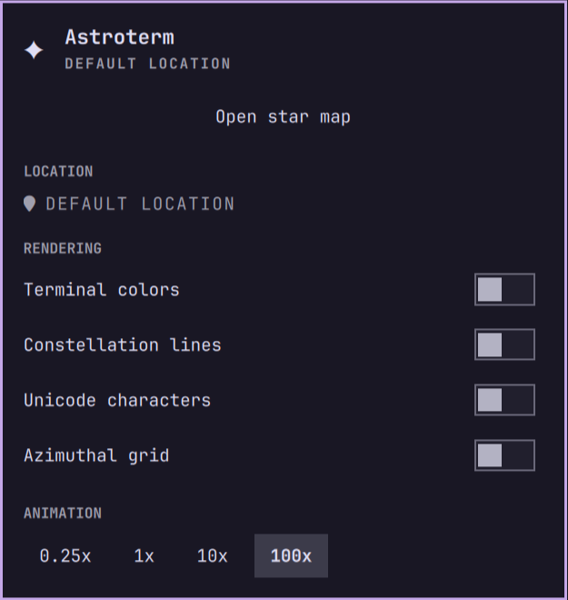
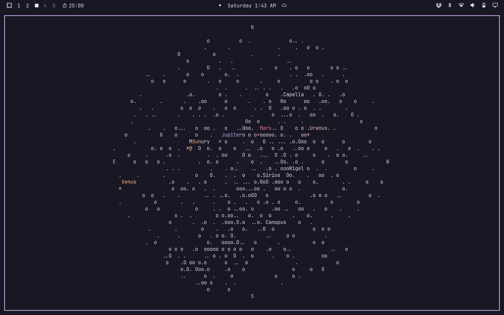

# Astroterm for Omarchy

A small Omarchy bar widget for launching [Astroterm](https://github.com/da-luce/astroterm),
a terminal-based planetarium. The widget includes a native Omarchy settings
popup for location and rendering preferences.

Astroterm is a separate application and must be installed first. The plugin
does not download, install, or modify Astroterm.

<p align="center">
  
  
</p>

The popup controls the view, while the star map opens in the configured Omarchy
terminal.

## Features

- Bar button with a `✦` icon
- Native settings popup with a searchable location field (geocoded suggestions) and rendering toggles
- Optional colors, constellation lines, Unicode characters, and azimuthal grid
- Animation speed presets
- Right-click launch shortcut
- Optional desktop launcher and Omarchy menu entry

## Requirements

- Omarchy Quattro with the shell plugin system
- Astroterm installed from your distribution; the Arch package provides
  `/usr/bin/astroterm` automatically
- `curl` for location search in the settings popup
- `jq` for the optional helper commands below

Install Astroterm before enabling this plugin. On Arch-based Omarchy systems,
you can use either:

```bash
yay -S astroterm
```

or **Omarchy > Install > AUR > astroterm**. No manual PATH configuration is
needed after installation.

## Install

Install and enable the plugin directly from GitHub:

```bash
omarchy plugin add https://github.com/gardensazurescens/omarchy-astroterm.git --enable
```

The plugin is placed in `~/.config/omarchy/plugins/` and can be moved to a
different bar section with:

```bash
omarchy bar move PLUGIN_ID --section left
```

Replace `PLUGIN_ID` with the `id` from `manifest.json`.

## Use

- Left-click the bar icon to open the settings popup.
- Click **Open star map** to launch Astroterm with the current settings.
- Right-click the bar icon to launch the current view without opening the popup.
- Press `Esc` to close the popup.

### Location

Click the location label (under **LOCATION**) to edit it. Type a city name and
pick one of the geocoded suggestions. The search uses the public Open-Meteo
geocoding API and does not require an API key. The name and exact coordinates
are saved and passed to Astroterm as `--latitude`/`--longitude`. Clear the field
to return to Astroterm's default coordinates. Without a stored location,
Astroterm uses its own default observer coordinates.

Settings are saved to the widget entry in `~/.config/omarchy/shell.json` and
apply the next time Astroterm is launched. An already running Astroterm process
does not reload command-line options.

## Configure From A Terminal

Set a shell variable to the plugin ID from the installed manifest before
running these commands:

```bash
PLUGIN_ID="$(jq -r '.id' /path/to/installed/plugin/manifest.json)"
omarchy bar set "$PLUGIN_ID" city "Phoenix" --json
omarchy bar set "$PLUGIN_ID" color true --json
omarchy bar set "$PLUGIN_ID" constellations true --json
omarchy bar set "$PLUGIN_ID" unicode true --json
omarchy bar set "$PLUGIN_ID" grid false --json
omarchy bar set "$PLUGIN_ID" speed 1 --json
```

When a `city` is set without `latitude`/`longitude`, the plugin falls back to
Astroterm's `--city` lookup. Setting `latitude` and `longitude` (numbers)
together takes precedence and is what the popup writes after you pick a
suggestion. The popup is the preferred way to change these values.

## Optional Launcher Integration

The repository includes `astroterm.desktop` and `omarchy-menu.jsonc` as
companion files. `omarchy plugin add` installs the shell plugin itself, but it
does not copy desktop files or merge menu extensions automatically.

To add the desktop launcher, copy `astroterm.desktop` from the installed plugin
directory to `~/.local/share/applications/`.

To add the Omarchy menu entry, merge the `astroterm` object from
`omarchy-menu.jsonc` into `~/.config/omarchy/extensions/omarchy-menu.jsonc`.
Merge it instead of replacing an existing extension file.

## Remove

```bash
omarchy plugin remove PLUGIN_ID
rm -f ~/.local/share/applications/astroterm.desktop
```

Remove the `astroterm` object from the menu extension if you added it manually.

## License

MIT. See [LICENSE](LICENSE).
